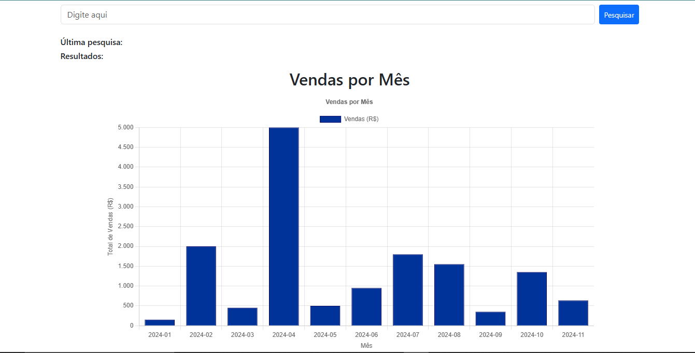

# LojaDeOculos
Sistema de gerenciamento de uma loja de óculos.
 
O sistema consiste em 3 tabelas que são a tabela produtos, clientes e vendas. Este sistema é um tabalho avaliativo da base técnica.
Tem como objetivo gerenciar e observar os produtos, vendas através de tabelas, gráficos e menu para alternar entre as páginas.
 
Ná página inicial terá as informaçãoes dos produtos e clientes junto com a pesquisa dessas tabelas já o menu leva para parte dos cadastros, gráfico e página inicial.
 
<h2>Referências</h2>
<a href="https://github.com/Adeilsoara/GraficosPHPMySQL">

<h2>Resultado esperado</h2>

<h2>Modelos conceitual e lógico</h2>

